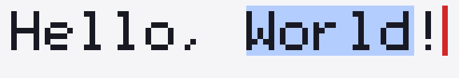

# B-lite drawn demo — the sighted-facing pixels

Date: 2026-06-25. Extends the headless B-lite spine (`../blite_host.cc`) with the
*other* half of the editor from `docs/11`: an actual drawn surface. It is the
lean, runnable first step toward the "B-lite made visual" milestone.



*Rendered by `blite_draw`: the surface text "Hello, World!", "World" selected
(blue), caret after "!" (red) — and the exact same layout produced the
`kCaretBounds`/selection/per-character rects the screen reader would read.*

## What it proves

The doc-11 non-negotiable constraint: **one layout pass is the single source of
truth feeding both the painter and the accessibility tree.** Here that is
literal — `layout_engine.h::LayOut()` runs once and the resulting `Layout` is
consumed by:

- **(a) the pixels** — `blite_draw.cc` rasterizes glyphs + selection + caret to
  a real image, and
- **(b) the accessibility geometry** — the same `Layout` yields the caret rect
  (`kCaretBounds`), the selection bounds, and per-character bounds that map to
  `AXNodeData` inline-text-box offsets.

Because both read the same `Layout`, the painted caret and the caret a screen
reader announces **cannot drift**. That coupling is the whole point; the font
and the CPU raster are deliberately throwaway.

## What it is (and isn't)

- **Is:** a standalone C++17 program (no Chromium tree, no Skia, no window)
  using an own 5x7 bitmap font + CPU raster, emitting a PPM and the matching AX
  geometry. Fully runnable on Linux today.
- **Isn't:** the production renderer. Real text shaping (HarfBuzz), real fonts
  (DirectWrite/CoreText/fontconfig), a GPU surface, a window, IME, and the live
  UIA provider are the Windows-first milestone in `docs/14-drawn-demo.md`. The
  `model -> one layout -> {pixels, a11y}` structure carries over unchanged; only
  the renderer and the AX sink are swapped.

## Build & run (no Chromium checkout needed)

```sh
g++ -std=c++17 -O2 blite_draw.cc -o /tmp/blite_draw
/tmp/blite_draw /tmp/blite_draw.ppm          # writes the image + prints AX geometry
python3 ppm_to_png.py /tmp/blite_draw.ppm sample.png   # optional: PPM -> PNG
```

Captured output: `../../results/blite-draw-run.txt`.

## Files

| File | Role |
|---|---|
| `layout_engine.h` | The single layout pass + `DocModel`/`Layout` structs. Dependency-free so it compiles standalone **and** inside the Chromium tree alongside `//ui/accessibility`. |
| `font5x7.h` | Lean 5x7 bitmap font (the throwaway part). |
| `blite_draw.cc` | Standalone renderer + AX-geometry dump. |
| `ppm_to_png.py` | Tiny stdlib PPM→PNG converter (for viewing). |
| `sample.png` | The rendered frame above. |
